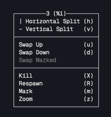

# tonkaew131's dotfiles

## Installation

Install prerequisite packages

```bash
brew install lazygit stow tmux
# Install oh-my-zsh
sh -c "$(curl -fsSL https://raw.githubusercontent.com/ohmyzsh/ohmyzsh/master/tools/install.sh)"
```

Install this config using GNU Stow:

```bash
git clone --recurse-submodules https://github.com/tonkaew131/dotfiles.git ~/.dotfiles
cd ~/.dotfiles
stow .
```

Install tpm plugins for tmux:

- `^` + `B` then `I` (uppercase i)

## Usage

Right click on the terminal to split the terminal window.



## Uninstallation

```bash
stow -D .
```

## Reference

- [How I manage my dotfiles using GNU Stow](https://tamerlan.dev/how-i-manage-my-dotfiles-using-gnu-stow/)

## Issues

- `tmux-plugins/tmux-yank` required [reattach-to-user-namespace](https://github.com/ChrisJohnsen/tmux-MacOSX-pasteboard)

```bash
brew install reattach-to-user-namespace
```
